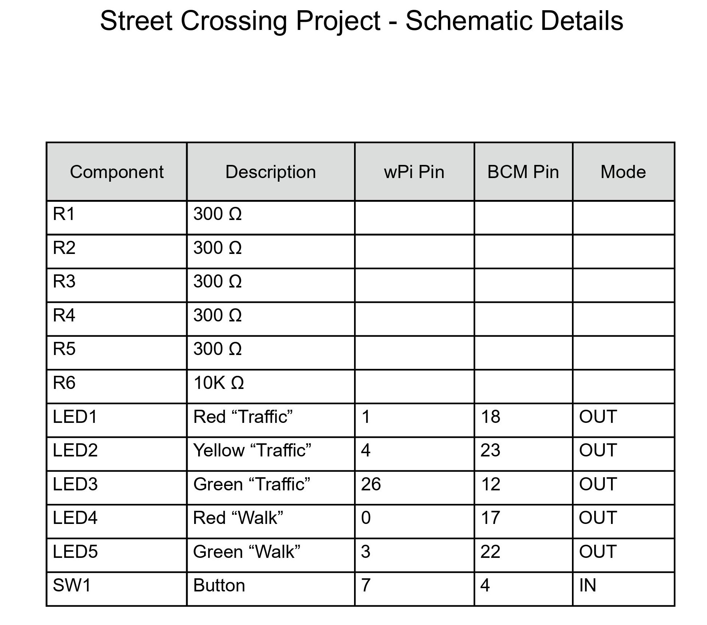

# 🚦 Street Crossing Traffic Signal Simulation

A Raspberry Pi assembly language project simulating a pedestrian crosswalk system, built entirely in ARM assembly.

### 📽️ **Demonstration Video**
[🎬 Watch on YouTube](https://youtu.be/pz-KCKyuoXM)

---

## 📖 Overview

This project demonstrates how to control GPIO pins directly in ARM assembly to simulate a crosswalk traffic signal with a button trigger.

Using the WiringPi library, the program lights up 5 LEDs (traffic and walk/don’t walk) in a timed sequence and responds to user input.

---

## ✨ Key Features

- **Button-triggered sequence**: starts when the pushbutton is pressed
- **Three-stage simulation**:
  1. Walk signal active
  2. Blinking “hurry up” signal
  3. Don’t Walk / Traffic resumes
- **Direct hardware control** using ARM assembly (`wiringPiSetup`, `digitalWrite`, `digitalRead`)
- **Console messages** showing sequence progression
- **Educational focus** on low-level programming concepts

---

## 🖼️ Screenshots

**Breadboard Schematic:**

**Breadboard Build - Walk Sequence:**

**Breadboard Build - Hurry Up Sequence:**

**Breadboard Build - Don't Walk Sequence:**

**Detailed Schematic:**

**WiringPi Pinout Reference:**

---

## 🧰 Technologies Used

- **Language:** ARM Assembly
- **Platform:** Raspberry Pi 3B+
- **OS:** Raspbian Linux 5.4.83-v7+
- **Library:** WiringPi (GPIO control)
- **Tools:**
  - g++ cross-assembler
  - Breadboard with LEDs and pushbutton
  - CanaKit Ultimate Starter Kit

---

## ⚙️ How to Build and Run

1. **Install WiringPi** (on Raspbian):

       sudo apt-get install wiringpi

2. **Assemble the code:**

       g++ streetxing.s -lwiringPi -g -o streetxing

3. **Run the program:**

       sudo ./streetxing

**Note:** `sudo` is required for GPIO access.

---

## ⚠️ Important Notes

- This project is for **educational demonstration only**.
- Full source code is included for reference—**please do not plagiarize** in academic settings.
- Hardware wiring must match the pin definitions in the code (`LED_TRAF_RED`, etc.).
- Timing delays and blink counts can be adjusted by modifying constants in `streetxing.s`.

---

## 📝 License

This project is shared for educational purposes.  
**No warranty expressed or implied.**

---
